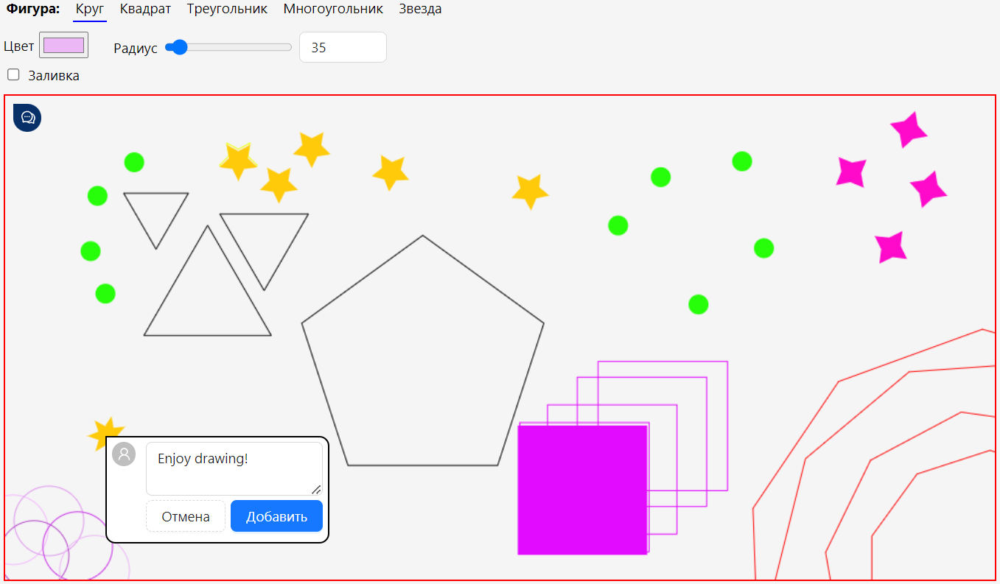

# SimpleDrawApp
Web draw app based on using canvas

### Github pages
You could try this app via link:
https://pashabezk.github.io/SimpleDrawApp/#/canvas

## Possibilities
This app contain canvas on which you could:
* draw shapes:
  * circle,
  * square,
  * triangle,
  * regular polygon,
  * star;
* leave comments,
* save created picture.

## Screenshot
In the picture below you can see an example of use.

